## Run the script to create a USB drive

### Prerequisites

You need to have a working Linux system with the following commands installed:

| Command path              | Debian package |
| ------------------------- | -------------- |
| `/bin/cat`                | coreutils      |
| `/bin/cp`                 | coreutils      |
| `/bin/date`               | coreutils      |
| `/bin/echo`               | coreutils      |
| `/bin/grep`               | grep           |
| `/bin/lsblk`              | util-linux     |
| `/bin/mkdir`              | coreutils      |
| `/bin/mktemp`             | coreutils      |
| `/bin/mount`              | mount          |
| `/bin/sed`                | sed            |
| `/bin/sleep`              | coreutils      |
| `/bin/umount`             | mount          |
| `/usr/bin/which`          | debianutils    |
| `/usr/bin/dirname`        | coreutils      |
| `/usr/bin/numfmt`         | coreutils      |
| `/usr/bin/pinentry-gtk-2` | pinentry-gtk2  |
| `/usr/bin/printf`         | coreutils      |
| `/usr/bin/realpath`       | coreutils      |
| `/usr/bin/sudo`           | sudo           |
| `/usr/bin/yad`            | yad            |
| `/sbin/fdisk`             | fdisk          |
| `/sbin/parted`            | parted         |
| `/sbin/mkfs.vfat`         | dosfstools     |
| `/sbin/mkfs.ext2`         | e2fsprogs      |
| `/usr/sbin/grub-install`  | grub2-common   |

Most of them are required also for the manual build.

### Run the script.

```
$ cd script
$ chmod +x ./create-multiple-iso-bootable-drive.sh
$ ./create-multiple-iso-bootable-drive.sh
```

### Guidance dialog

You will be presented with the dialog that tells what it is going to do.

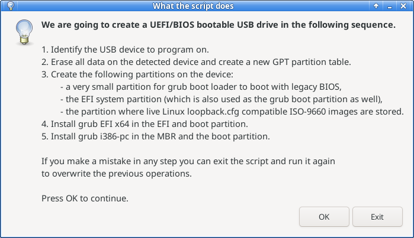

### Need to unplug the target USB device (if plugged in)

The script is going to detect the USB drive when you plug it in after this dialog.
So you need to plug it off for now if you have it plugged in already.

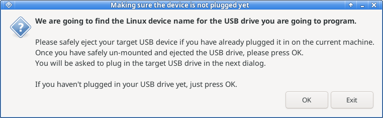

### Plug the target USB device in for the script to detect the device name

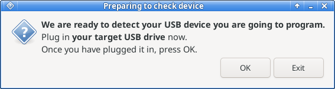

### Unique device is detected

If you have plugged in a single USB drive the script will recognize it.
Otherwise it will give an error message dialog which is not shown here.

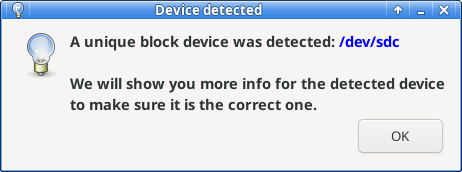

### Input user password for the sudo command

The next message will annouce the script is going to ask for your user password for running sudo later.
You can easily inspect the script source code to find the script won't use the password for any other purposes than running the sudo command for documented purposes.
Note that beforehand you need to configure your Linux account so that you can use the sudo command.

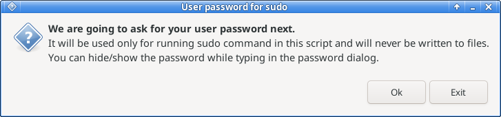

After pressing OK, it will present a Pinentry dialog (gtk2) for your password.
Here you can switch between show/hide the password you are typing in by clicking on the right button.

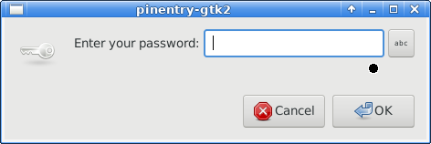

It will retry 3 times until a test sudo command succeeds.

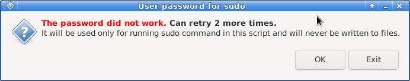

### Confirm if you want to overwrite the detected device

Look at the drive data to make sure you haven't plugged in a wrong USB drive.

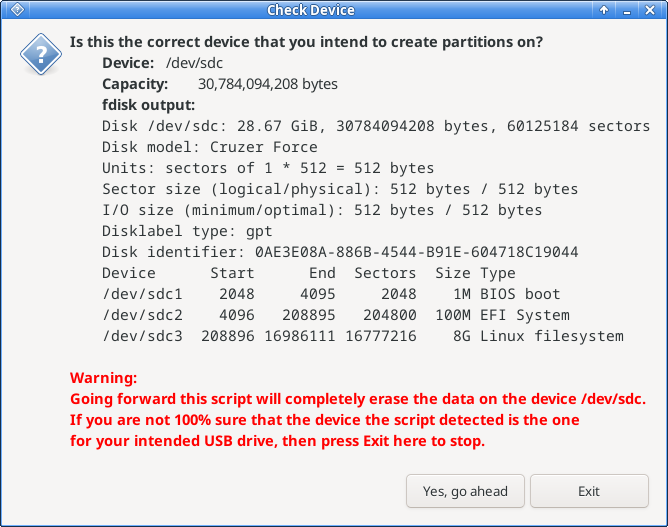

### Input the ISO files partition size

Decide the size of the ISO image files partition.
It is OK to use the whole remaining drive space if you don't plan to use the space for other purposes than booting the live Linux systems.

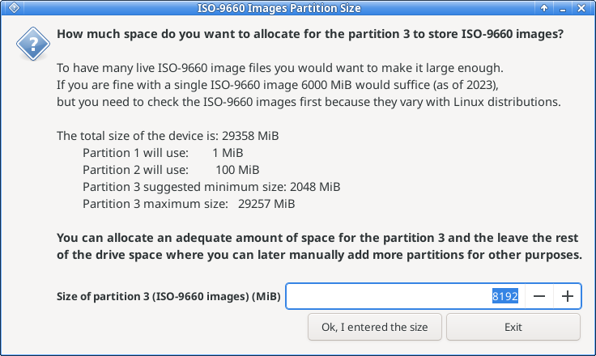

You can easily resize the 3rd partition later manually when you find you need more space to store ISO files.
(See [Manually create a USB drive](doc/manual-build.md)).
However you cannot and need not change the 1st and the 2nd partitions.
Anyway the 1st and the 2nd partitions are very small.

If you decide to leave drive space for other purposes after allocating some space for the 3rd partition,
you later need to manually create one or more partition(s) from the remaining unallocated space.

### Final confirmation before writing to the USB device

You will be presented with the final warning that the target drive will be erased and written over.

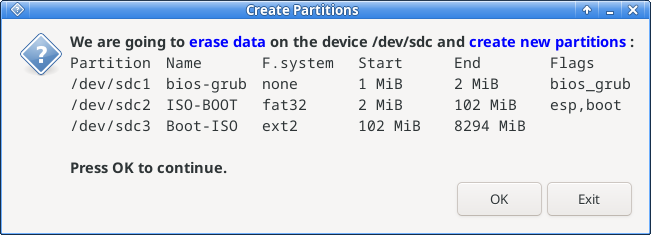

### Completion of partitioning

One more step of grub installation to go.

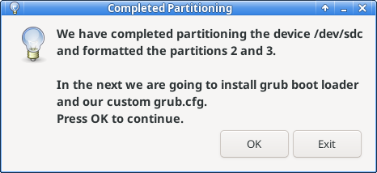

### Completion of grub installation

Installation of grub is done and the next step is to manually copy your favorite live Linux ISO image file(s) to the partition 3.

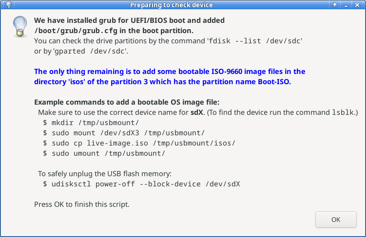

### Script log

The script will write a log to the shell terminal.
A sample log is as follows:
```
$ ./create-multiple-iso-bootable-drive.sh
detected plugged devices: /dev/sdb
detected plugged devices: /dev/sdb /dev/sdc
detected plugged devices: /dev/sdb /dev/sdc
detected a unique device: /dev/sdc
checking the size of device /dev/sdc.
size of /dev/sdc: 30784094208 bytes
user password obtained and being held in the variable user_password
device confirmed: /dev/sdc
size of the partition 3 confirmed: 8192
running /sbin/parted /dev/sdc
        --script mklabel gpt
        mkpart bios-grub 1MiB 2MiB
        set 1 bios_grub on
        mkpart ISO-BOOT fat32 2MiB 102MiB
        set 2 esp on
        set 2 boot on
        mkpart Boot-ISO ext2 102MiB 8294MiB
running mkfs.vfat -n ISO-BOOT /dev/sdc2
running mkfs.ext2 -L Boot-ISO /dev/sdc3
mke2fs 1.47.0 (5-Feb-2023)
Created a mount point /tmp/tmp.lpNY2MujnW-iso_9660_boot
Mounting /dev/sdc2 at /tmp/tmp.lpNY2MujnW-iso_9660_boot
Installing grub for legacy BIOS in the boot partition and MBR.
/usr/sbin/grub-install: error: /usr/lib/grub/i386-pc/modinfo.sh doesn't exist. Please specify --target or --directory.
Installing grub for UEFI in the EFI partition and the boot partition.
Installing for x86_64-efi platform.
Installation finished. No error reported.
Copying grub.cfg to /tmp/tmp.lpNY2MujnW-iso_9660_boot/boot/grub/grub.cfg
Un-mounting the /dev/sdc2
Created a mount point /tmp/tmp.0Qai6Wy5og-boot_iso_9660
Mounting the /dev/sdc3 at /tmp/tmp.0Qai6Wy5og-boot_iso_9660
Creating the directory /tmp/tmp.0Qai6Wy5og-boot_iso_9660/isos
Un-mounting the /dev/sdc3
We have installed grub for UEFI/BIOS boot and added /boot/grub/grub.cfg in the boot partition.
You can check the drive partitions by the command 'fdisk --list /dev/sdc' or by 'gparted /dev/sdc'.

The only thing remaining is to add some bootable ISO-9660 image files in the
directory 'isos' of the partition 3 which has the partition name Boot-ISO.

Example commands to add a bootable OS image file:
  Make sure to use the correct device name for sdX. (To find the device run the command lsblk.)
  $ mkdir /tmp/usbmount/
  $ sudo mount /dev/sdX3 /tmp/usbmount/
  $ sudo cp live-image.iso /tmp/usbmount/isos/
  $ sudo umount /tmp/usbmount/

  To safely unplug the USB flash memory:
  $ udisksctl power-off --block-device /dev/sdX

$ 
```

### Copy bootable live Linux ISO files to the partition 3.

The script will at the end of its run describe how to write bootable live Linux ISO files to the partition 3.
```
We have installed grub for UEFI/BIOS boot and added /boot/grub/grub.cfg in the boot partition.
You can check the drive partitions by the command 'fdisk --list /dev/sdc' or by 'gparted /dev/sdc'.

The only thing remaining is to add some bootable ISO-9660 image files in the
directory 'isos' in the partition 3 which has the filesystem label Boot-ISO.

Example commands to add a bootable OS image file:
  Make sure to use the correct device name for sdX. (To find the device run the command lsblk.)
  $ mkdir /tmp/usbmount/
  $ sudo mount /dev/sdX3 /tmp/usbmount/
  $ sudo cp live-image.iso /tmp/usbmount/isos/
  $ sudo umount /tmp/usbmount/

  To safely unplug the USB flash memory:
  $ udisksctl power-off --block-device /dev/sdX
```

You need to do this step manually.

After copying your bootable live Linux ISO images on the partition 3, you will be ready to test the drive on VirtualBox.
[Test run the USB drive on VirtualBox](./test-on-virtualbox.md)

