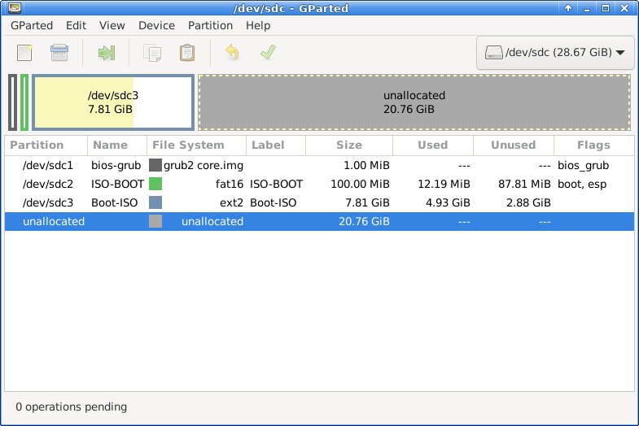

## Manually create a multiboot USB drive

### Determine which device is the right USB flash drive

First run the command `lsblk` to find the current block devices,
plug in the USB drive you are going to use for the multiboot drive,
and again run the command `lsblk`.
The device entry for their difference is the device name of your USB drive.

Now run the BASH shell and set the shell environment variable TheDevice to the device full path name.
BASH is required for the arithmetic operations below.
Replace `X` in `/dev/sdX` with the correct one for your USB drive.

```
$ TheDevice='/dev/sdX'
```

Here `$` means the shell prompt, so it is not something you type in the shell.

### Set shell environment variables for the GPT partition names and ISO 9660 directory

Set these shell environment variables to make it easy to type the commands later.
They are the partition names for the multiboot drive.
```
$ PARTITION_1_NAME='bios-grub'
$ PARTITION_2_NAME='ISO-BOOT'
$ PARTITION_3_NAME='Boot-ISO'
$ ISO_9660_DIRECTORY='isos'
```

The names `${PARTITION_2_NAME}` and `${PARTITION_3_NAME}` are used for GPT partition names as well as
for the labels of the filesystems on these partitions.

### Customize the partition names (Optional)

If you want to change any of these GPT partition names you can do so by assigning your favoriate names.

However at the same time you need to update the line in the `grub.cfg` file that refers to the partition by the name `Boot-ISO`:
```
# the filesystem label of the partition where boot ISO files are stored.
set Boot_ISO_Filesystem_Label='Boot-ISO'
```

### Customize the ISO directory name (Optional)

You can also change the name of the directory where ISO files are stored.
For that you change two places, one of the shell environment variable definition above:
```
ISO_9660_DIRECTORY='isos'
```
and the value of ISO_DIRECTORY in `grub.cfg`:
```
# the directory where all live Linux ISO files are found within the partition ${Boot_ISO_Filesystem_Label}
set ISO_Directory='/isos'
```

### Customize the ISO files partition size

You don't need to change the sizes of the 1st and 2nd partitions. They are small.
You can customize the size of the 3rd partition which is for storing ISO files.

Decide its size `part_iso_size_mib` and set the following continuing in the BASH session:
```
$ PARTITION_1_MIB=1
$ PARTITION_2_MIB=100
$ part_iso_size_mib=XXXX

$ part_1_begin_mib=1
$ part_1_end_mib=$(("${part_1_begin_mib}" + "${PARTITION_1_MIB}"))
$ part_2_end_mib=$(("${part_1_end_mib}" + "${PARTITION_2_MIB}"))
$ part_iso_end_mib=$(("${part_2_end_mib}" + "${part_iso_size_mib}"))
```

If you already have bootable live ISO files you can set the size larger than the sum of all your ISO file sizes.
Usually `part_iso_size_mib=4000` would be too tight for a large ISO file, but `part_iso_size_mib=8000` would be good enough for a single ISO file.

### Create a GPT partition table and its partitions

Run the command as follows.
Note that `\` at the end of the following lines is the line continuation in shell code,
so if you type the following in a single line then you need to remove `\` together with newlines.

Beforehand make sure you have already set all shell environment variables defined above.
```
$ /usr/bin/sudo /sbin/parted \
    "${TheDevice}"
    --align optimal \
    --script mklabel gpt \
    mkpart "${PARTITION_1_NAME}" "${part_1_begin_mib}"MiB "${part_1_end_mib}"MiB \
    set 1 bios_grub on \
    mkpart "${PARTITION_2_NAME}" fat32 "${part_1_end_mib}"MiB "${part_2_end_mib}"MiB \
    set 2 esp on \
    set 2 boot on \
    mkpart "${PARTITION_3_NAME}" ext2 "${part_2_end_mib}"MiB "${part_iso_end_mib}"MiB)
```

### Create filesystem on the partitions 2 and 3

You need a filesystem on the partition 2 and 3 but not on 1.

Here the partition names `${PARTITION_2_NAME}` and `${PARTITION_3_NAME}` used above are used as
the filesystem labels as well.
```
$ partition_2=/dev/sdX2
$ /usr/bin/sudo /sbin/mkfs.vfat -n "${PARTITION_2_NAME}" "${partition_2}"
$ partition_3=/dev/sdX3
$ /usr/bin/sudo /sbin/mkfs.ext2 -L "${PARTITION_3_NAME}" "${partition_3}"
```

The reason we use the Ext2 filesystem for the partition 2 is that
we can minimize the number of block write operations on the flash memory
by using Ext2 which doesn't have journaling and so
we can lessen the wearing of the flash memory.


### Install grub on the partition 2 and MBR

The first grub-install line in the code segment below installs grub for the legacy BIOS firmware,
and the second grub-install line installs grub for the UEFI firmware.
```
$ cd <package-root-directory>
$ /bin/mkdir /tmp/part2/
$ /usr/bin/sudo /bin/mount "${partition_2}" /tmp/part2/
$ /usr/bin/sudo /usr/sbin/grub-install --target=i386-pc --boot-directory=/tmp/part2/boot --removable "${TheDevice}"
$ /usr/bin/sudo /usr/sbin/grub-install --no-uefi-secure-boot --target=x86_64-efi --boot-directory=/tmp/part2/boot --efi-directory=/tmp/part2/ --removable
$ /usr/bin/sudo /bin/umount /tmp/part2/
```

### Copy grub.cfg to the directory /boot/grub/ in the partition 2

Change directory to the root directory of our package.
This is to ensure the command below can find the path to grub.cfg.
```
$ cd <package-root-directory>
```

Then you can install grub:
```
$ /usr/bin/sudo /bin/mount "${partition_2}" /tmp/part2/
$ /usr/bin/sudo /bin/cp grub/grub.cfg /tmp/part2/boot/grub/grub.cfg
$ /usr/bin/sudo /bin/umount /tmp/part2/
```

You can customize grub.cfg and use it instead of the provided one.

### Copy your live system ISO image file(s) to the directory "${ISO_9660_DIRECTORY}" in the partition 3
```
$ /bin/mkdir /tmp/part3/
$ /usr/bin/sudo /bin/mount "${partition_3}" /tmp/part3/
$ /usr/bin/sudo /bin/mkdir /tmp/part3/"${ISO_9660_DIRECTORY}"
$ /usr/bin/sudo /bin/cp your_live_system_1.iso /tmp/part3/"${ISO_9660_DIRECTORY}"
$ /usr/bin/sudo /bin/cp your_live_system_2.iso /tmp/part3/"${ISO_9660_DIRECTORY}"
...
$ /usr/bin/sudo /bin/umount /tmp/part3/
```

### Finish up

Safely eject the USB drive to synchronize all write operations to the flash media.
You can use the GUI or the command line:
```
$ udisksctl power-off --block-device "${TheDevice}"
```

Now you are ready to test the USB drive.
You can use VirtualBox for quick test or actually boot the systems on the computer.
[Test run the USB drive on VirtualBox](./test-on-virtualbox.md)


### If you want more space for ISO files

You can extend the partition 3.
If you have created other partitions after the partition 3, you need to back up the data on these partitions first and delete these partitions.
Then you can extend the partition 3.

In this example we use `gparted` command.

- Run `gparted` on the device.
  ```
  $ sudo gparted "${TheDevice}"
  ```
  

- Right-click on the partition with the name "${PARTITION_3_NAME}" (whose default is Boot-ISO),
  and choose Resize/Move operation from the popup menu and enter your size in New size (MiB) box.

  

  The screen capture above shows a pending operation that is waiting for its application.
  Now click the green check mark button in the toolbar to run th entered operation.

- Resizing is going on:

  

- Resizing is complete:

  

- Result of resizing:

  

