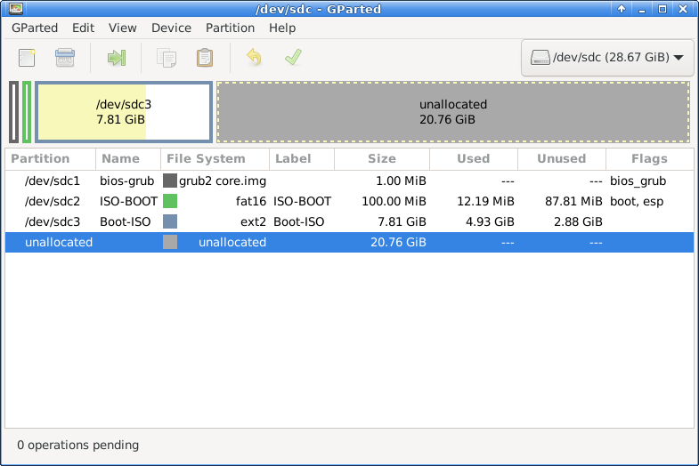

## Solution to booting multiple ISO 9660 files on both UEFI and legacy BIOS firmware

Let's list up what we require for the multiboot drive:

- The USB drive is capable of booting multiple bootable live Linux ISO 9660 image files stored on a drive partition,
- the USB drive works on UEFI firmware machines as well as on legacy BIOS firmware machines,
- we don't want to copy the file contents within the ISO 9660 image file to a drive filesystem.

We consider the following points:

- The drive can have either the GUID Partition Table (GPT) or the MBR (MSDOS) partition table,
  but the GPT is more flexible and easier to use than MBR partition table.
- GPT has no restriction on the number of partitions whereas MBR partition table has many restrictions.
- To boot an OS on a UEFI firmware the boot loader drive needs to have the EFI system partition (ESP) with a FAT16/FAT32 filesystem on it.
- To boot an OS via the grub boot loader the drive needs to have the grub boot directory and
  the grub boot directory can reside in the EFI partition without affecting EFI boot if you allocate a different directory for grub than the EFI directory.
- To boot an OS on a BIOS firmware from the drive that has the GPT partition table
  we need the BIOS Boot Partition (flagged with `bios_grub`) on the drive
  so that the MBR bootloader can jump to the BIOS Boot Partition to continue booting.

So our solution is the following:
1. Use the GPT partition table on the drive.
2. Create these three partitions:
   - the BIOS Boot Partition (bios_grub)
   - the EFI system partition (ESP)
   - the OS files partition
3. Install grub for EFI in the grub boot directory in the second partition.
4. Install grub for legacy BIOS in the MBR and in the grub boot directory in the second partition.

So the same `grub.cfg` is used for UEFI and BIOS firmware machines.

We will have the partitioning as shown below:




### Support for loopback.cfg by live Linux ISO systems

Our grub.cfg assumes that the live Linux ISO files support loopback.cfg as described at
.

The existence of loopback.cfg in the live Linux ISO filesystem is a convention to advertises that
the live system in the ISO image can boot via the grub boot loader from the ISO image file as a regular file on a regular filesystem (such as ext2)
instead of booting from the ISO filesystem written on the whole storage device.

When booting a loopback capable ISO image,
the first step is for grub to mount the ISO image as a loopback device and find the kernel and the initrd then load them in RAM and unmount the ISO.
The second step is for the kernel and initrd to mount the ISO image as a lookback device and load the file system image to continue booting.

So there are at least two conditions for the ISO image file so that it can boot in this way:
* The kernel and initrd within the ISO image can mount the ISO image as a loopback device.
* loopback.cfg will take care of all necessary kernel parameters.

Grub manual the section 5.2 Loopback booting says:
> GRUB is able to read from an image (be it one of CD or HDD) stored on
> any of its accessible storages (refer to *note loopback:: command).
> However the OS itself should be able to find its root.

We want to configure `grub.cfg` so that it can boot the OS by loading the ISO image on a loopback device.
The file `loopback.cfg` included in the ISO image will do almost everything so we only need to iterate through the ISO image files
to check whether they have `loopback.cfg` in the specified path and load their configurations via the grub `configfile` directive.
A template for `grub.cfg` is given at  as follows:
```
menuentry "TITLE" {
    iso_path=PATH
    export iso_path
    search --set=root --file $iso_path
    loopback loop $iso_path
    root=(loop)
    configfile /boot/grub/loopback.cfg
    loopback --delete loop
}
```

Our `grub.cfg` is very similar to this.

### Systems that support loopback.cfg

I have found the following live systems support loopback.cfg.

- Ubuntu ISO
- Debian Live ISO
- Custom Debian Live ISO (that was created via Debian live-build)
- Kali Linux ISO
- Linux Mint ISO
- Puppy Linux ISO

However Debian installer within Debian Live ISO and the standalone Debian installer ISO didn't work.
I suspect the reason could be the initrd doesn't support mounting ISO images as a loopback device.


### Note

Finding the solution described above was not easy for me not because the solution itself was difficult to understand
but because there were so many instructions on the internet that work only in limited cases or don't work at all.

Fortunately I found the right solution suggested by someone in the post at AskUbuntu.
I included these pages in the Reference section below.

I will also mention the wrong instructions so that you can avoid spending too much time trying to work with these ideas.
I hope they will be updated and corrected in the future.
They are in the non solutions section below.

## Reference

-  \
  How do I create a Multiboot USB that is compatible with both BIOS and UEFI? \
  The best answer in my view is the one given by C.S.Cameron answered Mar 30, 2020 at 4:02.

-  \
  How do I boot an ISO file from my drive using grub2 on UEFI machines? \
  The answer by C.S.Cameron on Apr 17, 2018 is the right one.

-  \
  EFI system partition

-  \
  EFI boot partition and bios_grub partition. \
  The answer by Rod Smith answered Jul 23, 2014 at 1:15 is the best one.

-  \
  UEFI with MBR partition table?

- 

-  \
  GRUB script to boot various Linux live CD/DVD images. \
  Nice grub.cfg code that iterates over ISO image files to find loopback.cfg.

-  \
  Automatically searches for iso images containing /boot/grub/loopback.сfg.

-  \
  How to boot from a flash drive OS using VirtualBox? \
  The answer by BerndK on Feb 26, 2023 is the best answer.

-  \
  UEFI + BIOS bootable live Debian stretch amd64 with persistence. \
  The best answer is by Schlimmchen answered Jul 30, 2017 at 21:39.
  It requires copying the ISO image content files to a boot partition.
  This works perfectly unlike many other solutions that claim to work.

- 

- 

-  \
  A project to boot multiple live Linux systems by loop-mounting ISO files
  and booting the operating system contained in the ISO image file.
  They provide a secondary initrd to help the kernel loop-mount the ISO file
  to achieve booting the ISO files that do not support loopback.cfg.


## Not exactly what I wanted to do

When I tried to do this I found only a very few articles on the web that give helpful guides.
There are many software that creates bootable USB drive from the live system ISO files,
but they usually don't satisfy all my requirements.

For example, the instruction by Debian Live is to write the Debian live ISO image file directly to the whole device.
> ISO images prepared with xorriso, can be simply copied to a USB stick with the cp program or an equivalent.
> 
> `$ cp live-image-i386.hybrid.iso ${USBSTICK}`

See
- 
- 

This method is not very flexible because the whole drive space is occupied by the ISO file system even though the actual content might be much smaller than the drive space.

Also the Debian Live manual section "4.3.3 Using the space left on a USB stick" suggests
that you can write the ISO image on to an ext4 partition instead of the whole device,
but it didn't work when I tested although it might work with some of legacy BIOS firmware.

Arch Linux gives a similar method of writing the ISO file to the whole drive media instead of a partition.


Ubuntu uses Windows software called Rufus to write their Ubuntu live ISO file to a USB drive.
I don't use Windows (except for when I have to use TurboTax once a year) so I natually am hesitant to use Rufus.
It looks like Rufus generated USB drives work only with either of UEFI firmare or BIOS firwmare not both, but I might be wrong.


Ubuntu has a tool called `mkusb` but this seems to allow only one ISO live system to be installed on the USB drive.
There seems to be no mkusb package for other Linux distributions.


## Non solutions

What are cited below might work in some situations (specific UEFI/BIOS, specifc USB flash models) but didn't work for me.

-  \
  Multiboot USB drive - ArchWiki. \
  None of the three methods worked.
  Arch Linux usually gives great and very informative documentation so I hope this page to be updated.

-  \
  Hybrid MBRs: The Good, the Bad, and the So Ugly You'll Tear Your Eyes Out. \
  The reason why hybrid MBR is a bad idea.

-  \
  The instruction works only for Legacy firmware boot but not for UEFI boot.

-  \
  Is it possible to boot Linux from a GPT disk on a BIOS system? - Super User. \
  The answers wrongly conclude it is impossible. People don't know how grub developers solved the problem by introducing bios_grub partition.

-  \
  How do I boot an ISO file from my drive using grub2 on UEFI machines? - Ask Ubuntu. \
  This is about booting on BIOS firmaware only.

-  \
  Only works with Legacy firmware boot mode, but not with UEFI boot mode.

