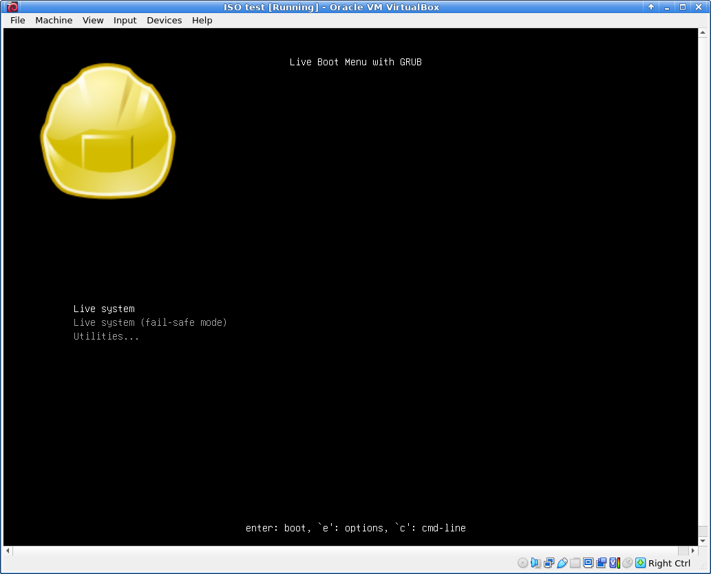
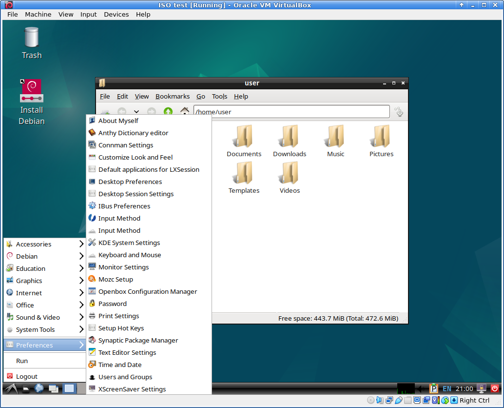

## Test on VirtualBox

We can test the resulting multiboot USB drive on VirtualBox to see how it boots

First copy some of your live Linux ISO images in the ISO directory of the multiboot USB drive.

This is the test I ran a while ago but I used the following ISO images in my test:
- ubuntu-22.04.2-desktop-amd64.iso
- custom Debian Live Bullseye
- debian-live-12.0.0-amd64-lxde.iso
- kali-linux-2023.2-live-amd64.iso
- linuxmint-21.1-xfce-64bit.iso

When finished copying ISO files, un-mount all of the multiboot drive partitions.
Keep the multiboot USB drive plugged in a USB slot.

### Create a virtual guest Linux

Create a virtual guest Linux OS on VirtualBox and set the necessary setting items.
You don't need to allocate a storage device for this purpose because we are booting from a USB external device.

### Click Settings of the guest Linux OS

### Enable EFI under System

### Add a USB device filter under USB

### In case the USB drive is not recognized

Try USB 3 if you have a USB recognition problem.

### Start the virtual guest

### A VirtualBox error that can be ignored

### grub is scanning all ISO image files

### grub has listed compatible ISO image files

Select one of them and press enter.

### A custom Debian Live grub menu

### Booting the custom Debian Live

### Booted the custom Debian Live

### The custom Debian Live app menu

### Shutting down the custom Debian Live

### The official Debian Live grub menu

### Booting Debian Live

### Booting Debian Live continuing

### Booted Debian Live

### Shutdown menu of Debian Live

### Booting Ubuntu

### Booting Ubuntu 2

### Booted Ubuntu ISO

### Ubuntu live or installation

### Booted Ubuntu live

### Ubuntu shutdown

### Kali Linux grub menu

### Booting Kali Linux

### Booted Kali Linux

### Kali applications menu

### Kali shutdown

### Puppy Linux grub menu

### Puppy Linux booting

### Puppy Linux booted

### Puppy Linux guide

### Puppy Linux shutdown

### Linux Mint grub menu

### Linux Mint booting

### Linux Mint booted

